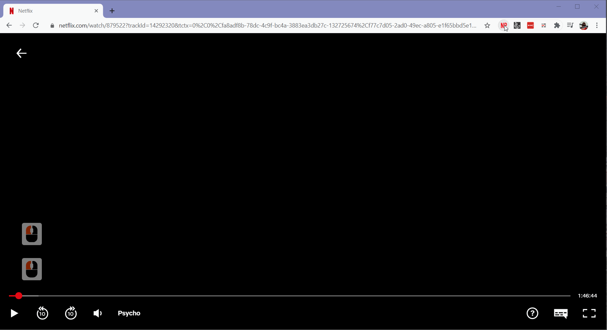

# Toggle Netflix Party Chat

Toggle the visibility of the Netflix Party chat by pressing <kbd>h</kbd>

  

## Installation in Chrome

1. Install [User JavaScript and CSS](https://chrome.google.com/webstore/detail/user-javascript-and-css/nbhcbdghjpllgmfilhnhkllmkecfmpld) Chrome extension.
2. Visit <https://www.netflix.com/>
3. Create a new rule by clicking the extension and paste the [JS snippet](./toggleNPChat.js).
4. Save the changes.
5. Return to Netflix.
6. Reload the browser (you might need to create a new Netflix Party session).
7. Enjoy!

ℹ Before pressing <kbd>h</kbd> to toggle the chat, make sure to click anywhere in the video. If the chat is in focus, the letter "h" is typed in the chat.